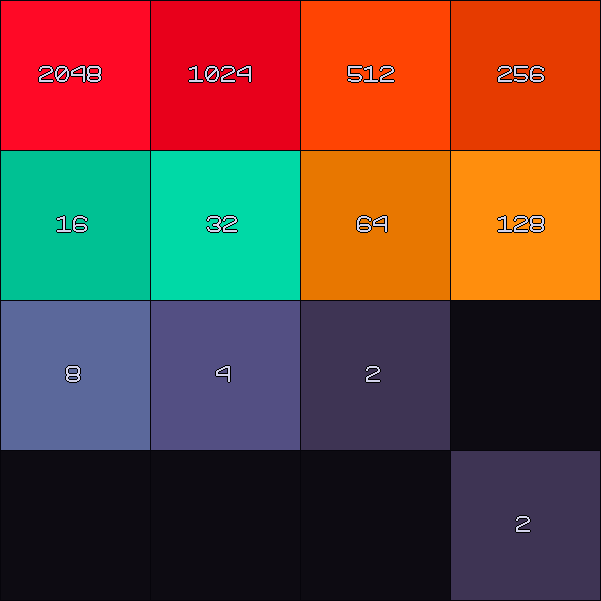

# 2048
Author: [paulpls](https://github.com/paulpls)  
License: [GPL 3.0](LICENSE.md)  

## About
Clone of the [original](https://github.com/gabrielecirulli/2048) built from scratch for the LÖVE 2D framework.  

## How to Play
**This repo is a work in progress. Functionality may be missing or incomplete.**  
- The game starts with two random tiles valued at either `2` or `4`.
- Move the squares around the grid using the arrow keys. When two squares meet, they will combine if equal in value.
- Each time the grid is moved, a new square will spawn in an empty space.
- If more than two adjacent squares in the direction of movement have equal value, only the furthest two will be combined, for example `0,2,2,2` when moved to the right becomes `0,0,2,4`.
- Beat the game by combining squares to acheive a `2048` square!
- The game is over when no legal moves are available.

## Installation & Runtime
- Install [LÖVE](https://www.love2d.org)
- Clone the repo and `cd` into it
- Run `love .`

## Controls
| Input      | Description  |
|:----------:|:-------------|
| Arrow keys | Move squares |
| f          | Fullscreen   |
| p          | Pause        |
| r          | Restart      |
| q, ESC     | Quit         |

## License Information
  
    Copyright (C) 2023 Paul Clayberg
    
    This program is free software: you can redistribute it and/or modify
    it under the terms of the GNU General Public License as published by
    the Free Software Foundation, either version 3 of the License, or
    (at your option) any later version.
    
    This program is distributed in the hope that it will be useful,
    but WITHOUT ANY WARRANTY; without even the implied warranty of
    MERCHANTABILITY or FITNESS FOR A PARTICULAR PURPOSE.  See the
    GNU General Public License for more details.
    
    You should have received a copy of the GNU General Public License
    along with this program.  If not, see <https://www.gnu.org/licenses/>.

